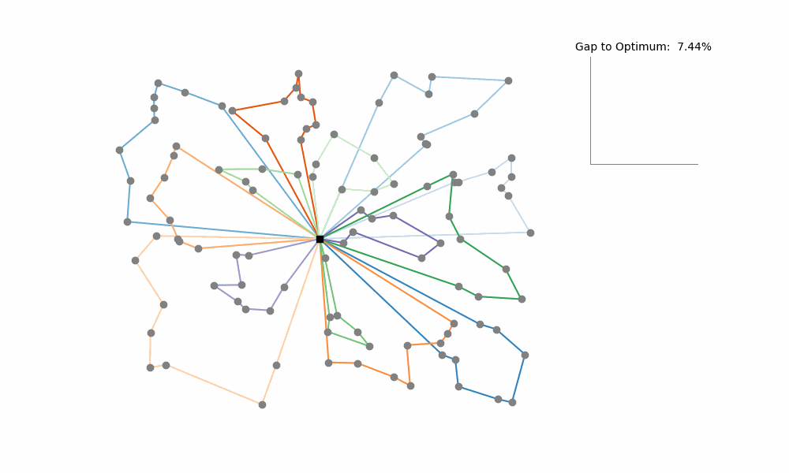

# Guided Local Search for Vehicle Routing Problems

This repository contains a Python implementation of the [Knowledge Guided Local Search]([https://www.sciencedirect.com/science/article/abs/pii/S0305054819300024]) (KGLS).

KGLS (a variation of Guided Local Search) is a powerful heuristic for solving the Vehicle Routing Problem (VRP) and its variants.
The algorithm iteratively searches for small, improving changes to the current solution (local search moves). 
When no further improvements can be made, KGLS penalizes unfavorable edges 
(as determined by domain-specific knowledge) 
to escape local optima and explore new parts of the solution space.



---

# Getting Started

## Prerequisites

This implementation requires Python 3.7+ and has minimal dependencies. 
Install matplotlib if you want to visualize solution progress, otherwise no other dependency is required:

```bash
pip install matplotlib
```

## Input Format
KGLS accepts VRP instance files as input. Example files are available in the `examples` directory 
or on the [VRP website](http://vrp.galgos.inf.puc-rio.br/index.php/en/).

## Usage Example

Some examples of, e.g., how to visualize a run or how to run a benchmark set can be 
found in folder `examples`.

```python 
from kgls import KGLS

# Initialize the solver with a VRP instance file
kgls = KGLS(path_to_instance_file)

# Set the termination condition (e.g., stop after 100 iterations without improvement)
kgls.set_abortion_condition("iterations_without_improvement", 100)

# Run the algorithm and visualize the progress
kgls.run(visualize_progress=True)

# Save the final solution to a file
kgls.best_solution_to_file(path_to_output_file)
```

The following parameters can be adapted, as in [this example](examples/custom_run/main.py).

| Parameter          | Description                                                                                                                         | Default Value                                          |
|--------------------|-------------------------------------------------------------------------------------------------------------------------------------|--------------------------------------------------------|
| `moves`           | The local search moves to use (in the given order).<br/> Currently implemented are: `segment_move`, `cross_exchange` and `relocation_chain` | [`segment_move`, `cross_exchange`, `relocation_chain`] |
| `neighborhood_size`       | The number of nearest neighbors to which a node can be connected.                                                                   | 20                                                     |
| `num_perturbations`       | The number of moves which have to be executed with penalized costs during the perturbation phase.                                   | 3                                                      |
| `depth_lin_kernighan`     | The maximum number of edge exchanges in the lin-kernighan heuristic.                                                                | 4                                                      |
| `depth_relocation_chain`  | The maximum number of relocation moves which can be executed in a relocation chain.                                                 | 3                                                      |

For additional usage examples refer to the `examples` directory, e.g., 
[running benchmark sets](examples/run_benchmark/main.py). 

### Is Python not too slow to implement a State-of-the-Art heuristic?

While Python is generally slower than compiled languages like C++ or Java, 
it offers some advantages in terms of ease of use, especially for aspiring data scientists. 
And with a few tips, its performance can be brought to an acceptable level:
- **Stay close to default parameters:** The suggested default parameters, as they have been optimized for performance
- **Turn visualization off:** Visualization increases runtime by some factor. 
- **Use PyPy as interpreter:** [PyPy](https://pypy.org/), a just-in-time (JIT) compiling Python interpreter, can deliver runtime performance improvements of 2x or more compared to CPython.
- **TODO** Pre-compile local search operators with Cython

---

## Implemented local search moves

KGLS employs four local search heuristics to iteratively improve the solution.

1. **Segment Relocation**
    Moves a segment of nodes (i.e., either a single or multiple connected nodes) from one route to another. Note: In the original paper Segment Relocations are contained in CROSS Exchange.

2. **CROSS Exchange**
    Exchanges segments between two routes.

3. **Relocation Chain**
    Performs a series of relocation moves (i.e., moving one node to another route), such that the resulting solution remains feasible.

4. **Lin-Kernighan Heuristic**
    A powerful and flexible edge exchange heuristic originally designed for the Travelling Salesman Problem. KGLS uses a simplified implementation to improve routes in themselves.

---

## Contributions
Contributions to this repository are welcome! 
If you have ideas for new features, optimizations, or extensions, feel free to open an issue or submit a pull request.

---

## References
[Original KGLS Paper](https://www.sciencedirect.com/science/article/abs/pii/S0305054819300024)

[VRP Repository](http://vrp.galgos.inf.puc-rio.br/index.php/en/)

---

## License
This project is licensed under the MIT License. See the LICENSE file for details.
